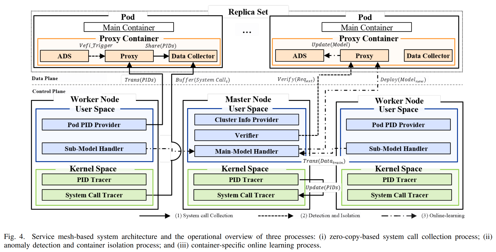
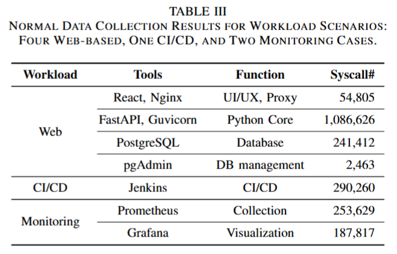
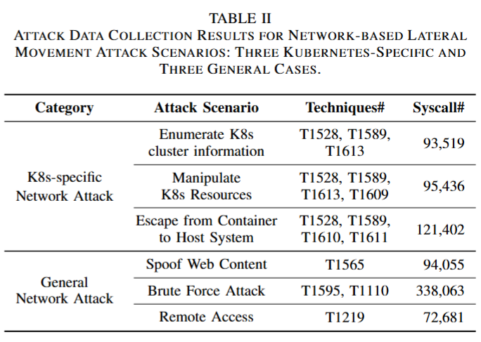
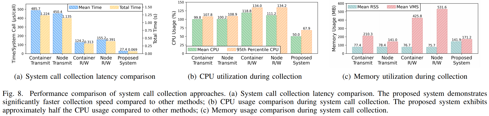
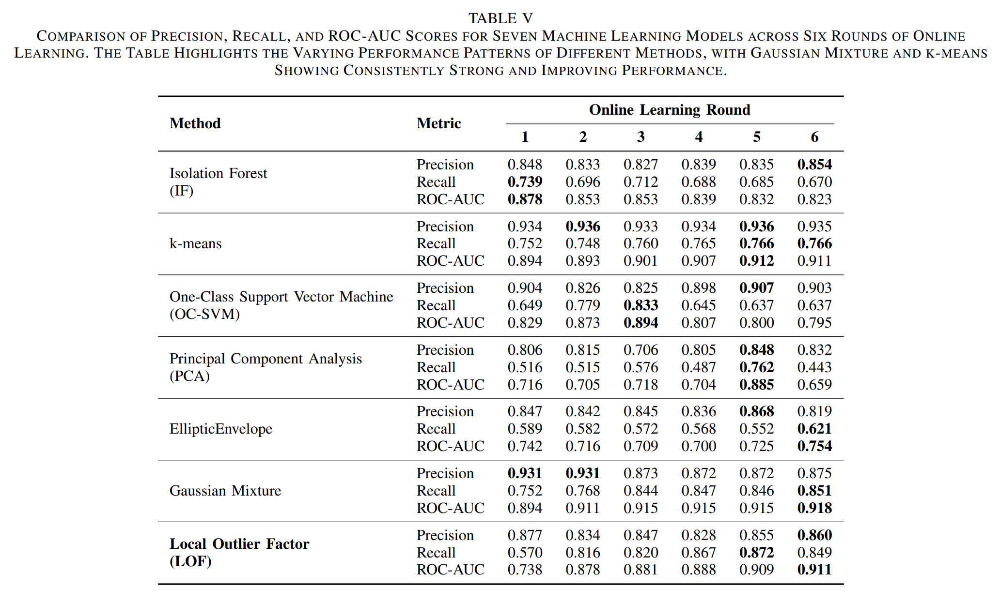
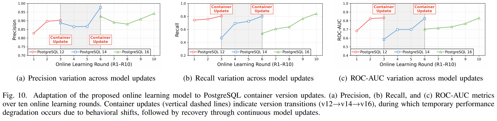

# Container-Specific Service Mesh-based System for Mitigating Lateral Movement Attacks

This repository contains the implementation of a **container-specific service mesh-based system designed to mitigate lateral movement attacks in cloud-native environments**. It also provides the source code and the **Kubernetes-specific dataset** created for training and evaluating anomaly detection models in such environments.

# Overview

  

    
  

 

The dynamic nature of containers within a Kubernetes cluster substantially expands the potential attack surface. In particular, lateral movement attacks enable adversaries to compromise additional subsystems after gaining initial access. To defend against lateral movement attacks, most anomaly detection methods rely on offline learning using system call data accumulated over a period of time. However, such offline learning methods struggle to capture the unique system call patterns of individual containers and lack adaptability to changes caused by frequent container updates. To address these limitations, we propose a new service mesh-based system for online learning of container-specific system call patterns observed under cloud-native microservice environments. The proposed service mesh-based system consists of three key functional processes as follows: (i) a zero-copy-based system call collection process, which leverages eBPF for efficient monitoring; (ii) an anomaly detection and container isolation process, which employs lightweight machine learning models, and leverages a proxy container for swift traffic control; and (iii) a container-specific online learning process, which continuously updates anomaly detection models by learning observed system call sequences. From the experimental results, we show that the proposed zero-copy-based system call collection process significantly improves system call collection speeds by as much as 4.5 times and shows lower CPU usage by as much as half compared to other state-of-the-art methods. Furthermore, the container-specific online learning process consistently outperforms offline learning approaches across various system call datasets and maintains stable detection performance by continuously adapting to behavioral changes caused by container updates over time.

# Kubernetes-Specific Datasets

## Normal Workload Scenarios

    

## Attack Scenarios Based on the MITRE ATT&CK Framework

    

# How to Use

The Container-Specific Service Mesh-based System was implemented and evaluated on Kubernetes running on Ubuntu 20.04 LTS with Linux kernel 5.4.0.
Follow the steps below to deploy and run the system:

1. Run `ServiceMesh/ControlPlane/masterNode.py` on the master node to launch the master-side modules.

2. Run `ServiceMesh/ControlPlane/workerNode.py` on the worker node to execute the worker-side modules.

3. Build the proxy container image using `ServiceMesh/DataPlane/Dockerfile`.

4. Configure `ServiceMesh/DataPlane/sidecar.yaml` to specify the main container to be monitored, target ports, and other parameters.

5. Deploy the built image to your Kubernetes cluster.

6. Enjoy the zero-copy-based system call collection in the proxy container and the online learning of container-specific models.

# Performance Evaluation

## Performance Analysis of Zero-Copy-based System Call Collection Mechanism

    

## Detetion Performance of Machine Learning Models under Different Online Learning Parameters

    

## Model Adaptation under Container Version Changes

    

